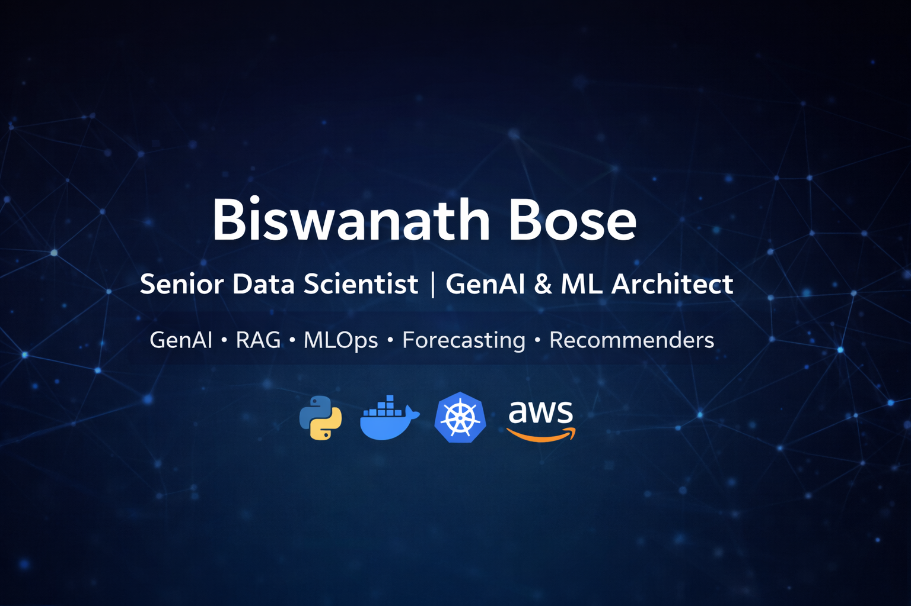

<!-- =========================
     HERO / BANNER
========================= -->

  

<h1 align="center">Biswanath Bose</h1>

  <b>Senior Data Scientist / AI-ML Engineer • GenAI • RAG • MLOps • Time-Series • Recommenders</b>

  Building production-ready AI systems: Retrieval-Augmented Generation (RAG), Agentic AI, Forecasting/Anomaly Detection, and MLOps on AWS/GCP.

<!-- =========================
     QUICK LINKS
========================= -->

  <a href="https://www.linkedin.com/in/biswanath-bose/">LinkedIn</a> •
  <a href="mailto:bose62492gmail.com">Email</a> •
  <a href="https://github.com/biswanathbose-cicd">GitHub</a> •
  <a href="https://github.com/biswanathbose-cicd/ai-ml-portfolio//">Portfolio</a> •
  <a href="https://www.youtube.com/@YOUR_CHANNEL">YouTube</a>

<!-- =========================
     BADGES
========================= -->

  
  
  
  

---

## 👋 About Me

- 🎯 Focus: **GenAI (RAG/Agents), ML Engineering, Forecasting/Anomaly Detection, MLOps**
- 🧠 Strong in: **Python, ML/DL, NLP, Vector DBs, Docker/K8s, CI/CD**
- 🌍 Cloud: **AWS / GCP**
- ✅ I love building **end-to-end projects**: data → model → API → deployment → monitoring

---

## 🚀 Featured Projects

> Each card is designed for a quick 30-second scan: **Problem → Solution → Stack → Links**

### ⭐ 1) Kubernetes Observability Lab on AWS (Terraform + Minikube + ELK)

**Problem:** Setting up a reproducible Kubernetes lab with centralized logging & monitoring on AWS is time-consuming and inconsistent when done manually.
**Solution:** Terraform provisions AWS infrastructure and bootstraps a Minikube-based Kubernetes cluster, then installs Prometheus + Fluent Bit + Logstash + Elasticsearch + Kibana to view app and cluster logs in Kibana.
**Tech:** Terraform, AWS (EC2/VPC/IAM), Ubuntu, Docker, Minikube, kubectl, Prometheus, Fluent Bit, Logstash, Elasticsearch, Kibana
🔗 **Repo:** https://github.com/biswanathbose-cicd/terraform-minikube-elk-observability

🎥 Demo: https://www.youtube.com/watch?v=OQ-xL9RxJz8&t=7s
---

### ⭐ 2) Manufacturing Yield Analytics (Golden Batch / Best vs Worst)
**Problem:** Identify yield variability drivers & process deviations across batches.  
**Solution:** Statistical + ML analysis + dashboarding for root-cause insights.  
**Tech:** Python, Dataiku, Power BI, Time-series, PCA/UVA/MVA  
🔗 **Repo:** https://github.com/YOUR_GITHUB_USERNAME/REPO_NAME  
📊 **Dashboard Screens:** `assets/project_screenshots/yield_dashboard.png`

---

### ⭐ 3) PI Tag Time-Series Forecasting + Anomaly Detection
**Problem:** Detect anomalies early and forecast critical process signals.  
**Solution:** Feature engineering + anomaly models + forecasting pipeline.  
**Tech:** Python, STL/Prophet/ARIMA, IsolationForest, Dash/Plotly  
🔗 **Repo:** https://github.com/YOUR_GITHUB_USERNAME/REPO_NAME

---

### ⭐ 4) Recommendation System (Co-Clustering + Deep Learning Upgrade)
**Problem:** Improve personalization & evaluate with precision@k/recall@k/F1@k.  
**Solution:** Baseline co-clustering + roadmap for autoencoder/transformer upgrade.  
**Tech:** scikit-learn, PyTorch/TensorFlow (optional), SageMaker/Lambda, Streamlit  
🔗 **Repo:** https://github.com/YOUR_GITHUB_USERNAME/REPO_NAME

---

### ⭐ 5) Agentic AI with LangGraph (Supervisor + Tools + Memory)
**Problem:** Build a multi-step reasoning agent for enterprise workflows.  
**Solution:** Multi-agent orchestration with tools, memory, and guardrails.  
**Tech:** LangGraph, FastAPI, Docker, Vector DB, Observability  
🔗 **Repo:** https://github.com/YOUR_GITHUB_USERNAME/REPO_NAME

---

## 🧭 Project Index (All Projects)
| Category | Projects |
|---|---|
| GenAI / RAG | RAG Email Automation, Doc Intelligence RAG, Agentic Workflows |
| Time Series | PI Tag Forecasting, Anomaly Detection, Feature Extraction |
| Recommenders | Co-Clustering Recommender, Deep Learning Personalization |
| MLOps / Deployment | FastAPI + Docker, CI/CD, MLflow Registration, K8s Deploy |

> Tip: Keep **each project** either as (A) its own repo, or (B) a folder under `projects/` with a README.

---

## 🧰 Core Tools & Tech I Use

  <!-- Languages -->
  
  
  

  <!-- ML / Data -->
  
  
  

  <!-- Dev -->
  
  
  
  
  

  <!-- Cloud -->
  
  

  <!-- Databases -->
  
  

  <!-- Editors -->
  

---

## 📈 GitHub Analytics & Fun Stuff

### 🐍 Contribution Snake

  

### 📊 GitHub Stats

  
  

### 🔥 Streak

  

---

## 📬 Contact
- LinkedIn: https://www.linkedin.com/in/biswanath-bose/
- Email: bose6249@gmail.com

---

## ✅ How to Use This Repo
1) Browse **Featured Projects**  
2) Click into the repo link for details: dataset, architecture, how-to-run, demo  
3) If you’re a recruiter: start with projects 1–3 for fastest signal ✅

